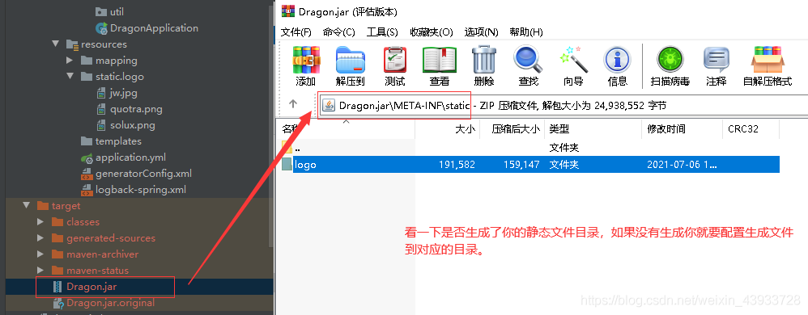

> 首先你要明白你的静态文件是classpath还是file。如果是classpath配置，建议先打印路径看看你打印出来的路径和你请求的路径地址是否一致。file的话就直接是绝对路径。

1. pom.xml文件配置

```xml
<build>
    <resources>
        <resource>
            <directory>src/main/resources</directory>
            <includes>
                <include>**/*.properties</include>
                <include>**/*.xml</include>
                <include>**/*.yml</include>
            </includes>
            <filtering>true</filtering>
        </resource>
        <!-- 主要是这里：打包resources/static静态资源文件放到META-INF/static -->
        <resource>
            <directory>src/main/resources/static</directory>
            <targetPath>META-INF/static</targetPath>
        </resource>
    </resources>
</build>
```

2. 查看文件是否在jar包里



3. 配置类

```java
@Configuration
public class XXXConfig implements WebMvcConfigurer {
    //二维码、导入Excel时的临时存放路径
    public static String tempPath = System.getProperty("user.dir") + "/temp/";
    //图片存放路径
    public static String imgPath = System.getProperty("user.dir") + "/imgPath/";

    /**
     * 静态资源拦截
     */
    @Override
    public void addResourceHandlers(ResourceHandlerRegistry registry) {
        System.out.println(imgPath);//打印你的classpath或者file地址，看一下打印出来的地址和你请求的地址是否一致。不一致就要打包的时候配置一致的路径。建议放到META-INF文件夹里面，这样就可以直接用我的配置就行了。
        registry.addResourceHandler("/**")
                //classpath:后面不要加/否则路径就会错误，防止错误路径的办法就是先打印路径，路径正确在加进来。
                //取消模板static路径拦截
                .addResourceLocations("classpath:META-INF/static")
                //取消图片拦截
                .addResourceLocations("file:" + imgPath)
                //取消二维码路径拦截
                .addResourceLocations("file:" + tempPath);
    }
}
```

4. 直接ip:port/static/文件相对路径。如：localhost:8080/static/logo/jw.jpg